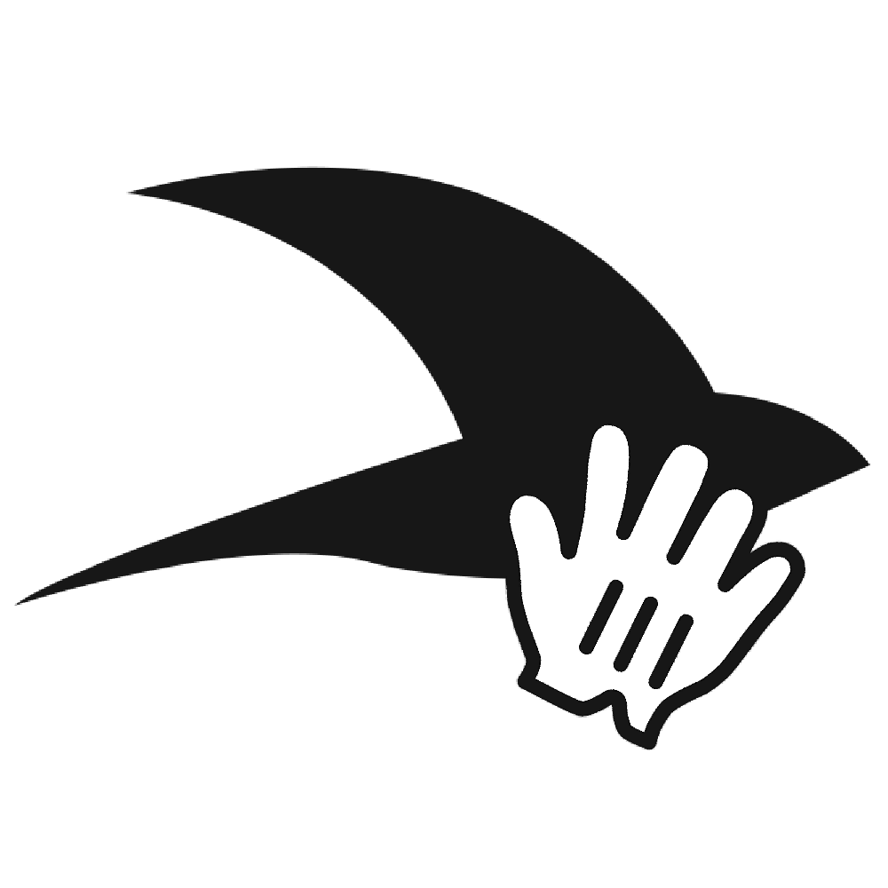

<p align="center">
  
</p>

<h1 align="center">rune-grab</h1>

<p align="center">
  Point at any element. Get the component, file path, and line number. Send it to your AI tool.
</p>

<p align="center">
  <a href="https://www.npmjs.com/package/rune-grab"></a>
  <a href="https://www.npmjs.com/package/rune-grab"></a>
  <a href="https://bundlephobia.com/package/rune-grab"></a>
  <a href="https://github.com/YOUR_USERNAME/rune-grab/blob/main/LICENSE"></a>
</p>

<p align="center">
  <video src="public/demo.mp4" width="720" autoplay loop muted />
</p>

<p align="center">
  Works with React, Vue, Svelte, and plain HTML.<br />
  Supports Vite, Next.js, and Webpack. Only loads in development — nothing ships to production.
</p>

---

## Install

```bash
npx rune-grab init
```

Run your dev server and press **Cmd+Shift+G** to start grabbing.

## How it works

A small floating menu appears at the bottom of your page during development. It has two modes:

**Screenshot** — drag a rectangle to capture a region as a screenshot with context.

**Inspect** — hover over any element to see its component name and file path. Click it, optionally type a comment, and press Enter to send.

Everything is copied to your clipboard. On localhost, rune-grab auto-detects React, Vue, and Svelte components with file paths and line numbers.

## Auto-paste (optional)

By default, grabs go to your clipboard and you paste manually. If you want rune-grab to automatically switch to Claude, Cursor, or Codex and paste for you:

```json
{
  "scripts": {
    "dev": "rune-grab serve & your-dev-command"
  }
}
```

Then flip the auto-paste toggle in the floating menu. macOS only.

## Configuration (optional)

Everything works out of the box. If you want to change the shortcut, default target, or other behavior, call `init()` in your code:

```ts
import { init } from 'rune-grab'

init({
  shortcut: 'Meta+Shift+K',
  target: 'claude',
  skipComponents: ['StyledButton']
})
```

| Option | Type | Default | Description |
|--------|------|---------|-------------|
| `shortcut` | `string` | `'Meta+Shift+G'` | Keyboard shortcut |
| `target` | `TargetApp` | `'clipboard'` | Default target: `clipboard`, `claude`, `cursor`, `codex`, `claude-code` |
| `showTargetPicker` | `boolean` | `true` | Show target picker in menu |
| `maxStackDepth` | `number` | `3` | Component stack trace depth |
| `skipComponents` | `string[]` | `[]` | Component names to ignore |
| `onGrab` | `(result) => void` | — | Callback on grab |
| `onToggle` | `(active) => void` | — | Callback on toggle |

## Uninstall

```bash
npx rune-grab remove
```

This removes the injected snippet from your project and uninstalls the package in one step.

## License

MIT
